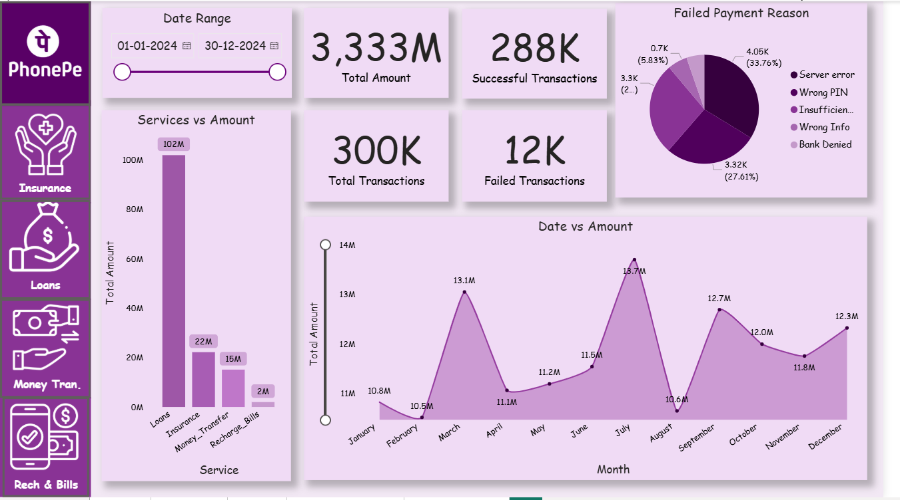
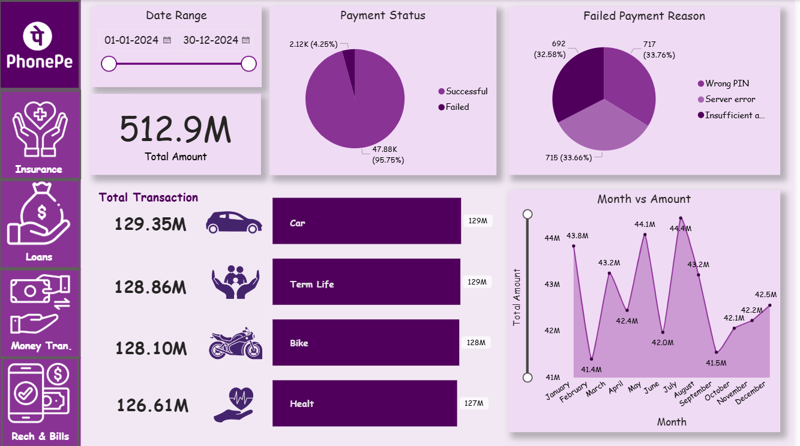
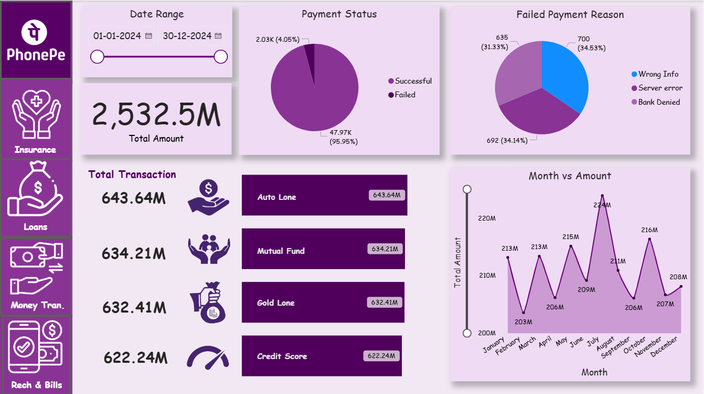
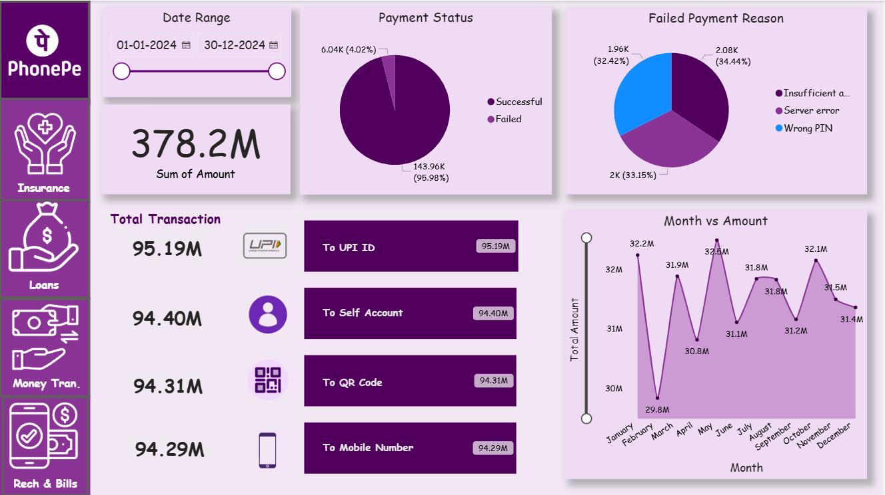
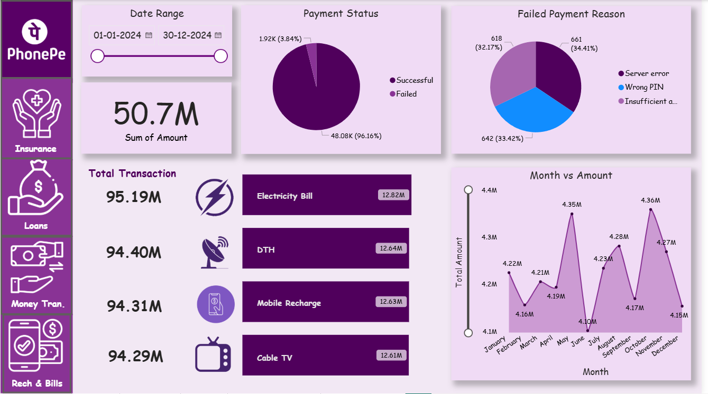

# PhonePe Transaction Analysis Dashboard
Power BI Dashboard Drive Link - https://drive.google.com/file/d/1zrMdKhHJ18hdDOM3HDKggZUWg82yzKxq/view?usp=sharing

## Project Overview

This project focuses on analyzing digital payment transaction data for a PhonePe-like platform using Power BI. The dashboard was designed to monitor transaction performance, payment success rates, failed payment reasons, and service-wise business metrics.

The project simulates a real-world Business Intelligence workflow where stakeholders can dynamically explore transaction insights and monitor operational performance using interactive visualizations.

---

## Business Problem Statement

Digital payment platforms process millions of daily transactions across services such as insurance, loans, money transfers, and recharge payments.

Without proper data analysis, it becomes difficult to:

- Monitor transaction performance across services
- Identify high-revenue business segments
- Detect operational issues and failed payments
- Track monthly transaction trends
- Improve customer experience and payment reliability

This project aims to answer the following business questions:

- What is the total transaction volume across services?
- Which services contribute the most revenue?
- What are the common reasons for failed transactions?
- How do transaction trends vary over time?
- How can insights improve operational efficiency?

---

## Tools and Technologies Used

| Tool | Purpose |
|---|---|
| Power BI Desktop | Dashboard development and visualization |
| Microsoft Excel | Data cleaning and validation |
| Power Query Editor | Data transformation and preprocessing |
| DAX | KPI calculations and calculated measures |

---

# Dashboard Pages

## Homepage Dashboard



---

## Insurance Dashboard



---

## Loan Dashboard



---

## Money Transfer Dashboard



---

## Recharge and Bills Dashboard



---

## Dashboard Features

- Interactive date range filtering
- KPI cards for transaction metrics
- Payment success vs failure analysis
- Failed payment reason analysis
- Monthly transaction trends
- Service-wise performance monitoring
- PhonePe-inspired dashboard theme

---

## Key Insights

- Most transactions were generated through Money Transfer and Recharge services.
- Failed transactions were primarily caused by server errors and insufficient balances.
- Interactive filters enabled dynamic service-level analysis.
- Monthly transaction trends highlighted peak transaction periods.
- The dashboard improved visualization and operational monitoring of payment services.

---

## Project Structure

```text
PhonePe-Transaction-Analysis-Dashboard/
│
├── 01.Problem Statement.pdf
├── 02.REPORT.pdf
├── Phonepe-Final-Dataset (1).xlsx
├── README.md
├── screenshotshomepage.png
├── screenshotsinsurance_dashboard.png
├── screenshotsloan_dashboard.png
├── screenshotsmoney_transfer_dashboard.png
└── screenshotsrecharge_dashboard.png
